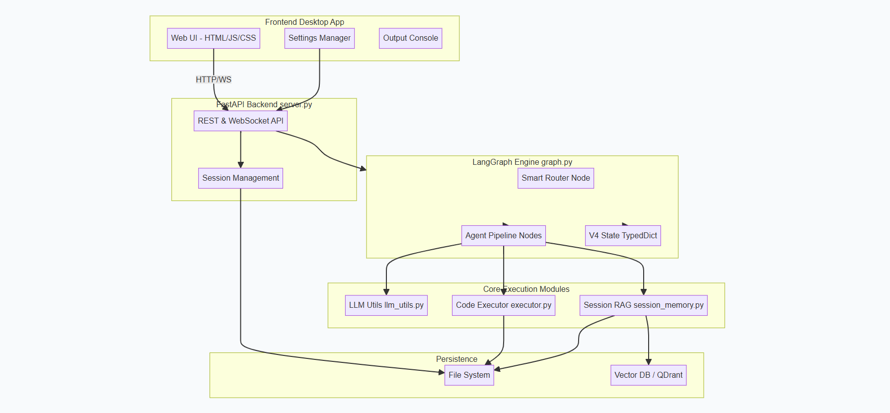
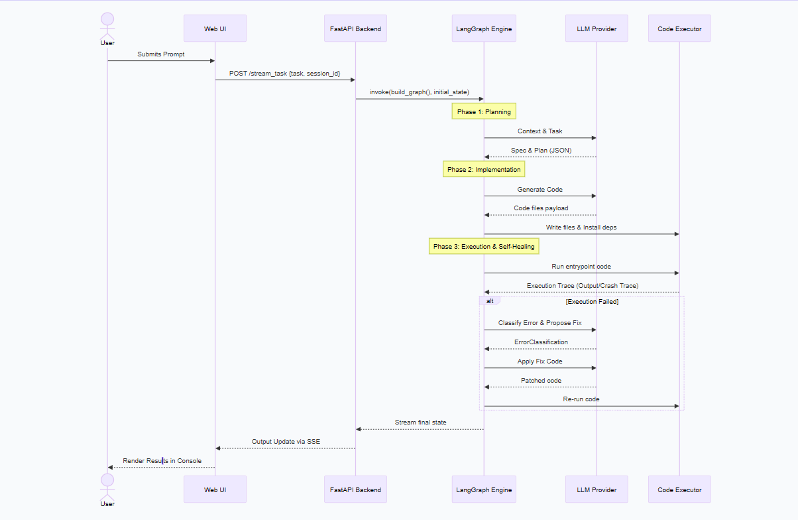
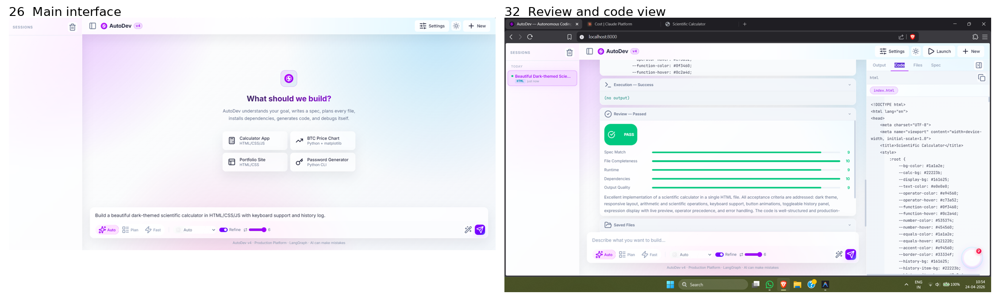
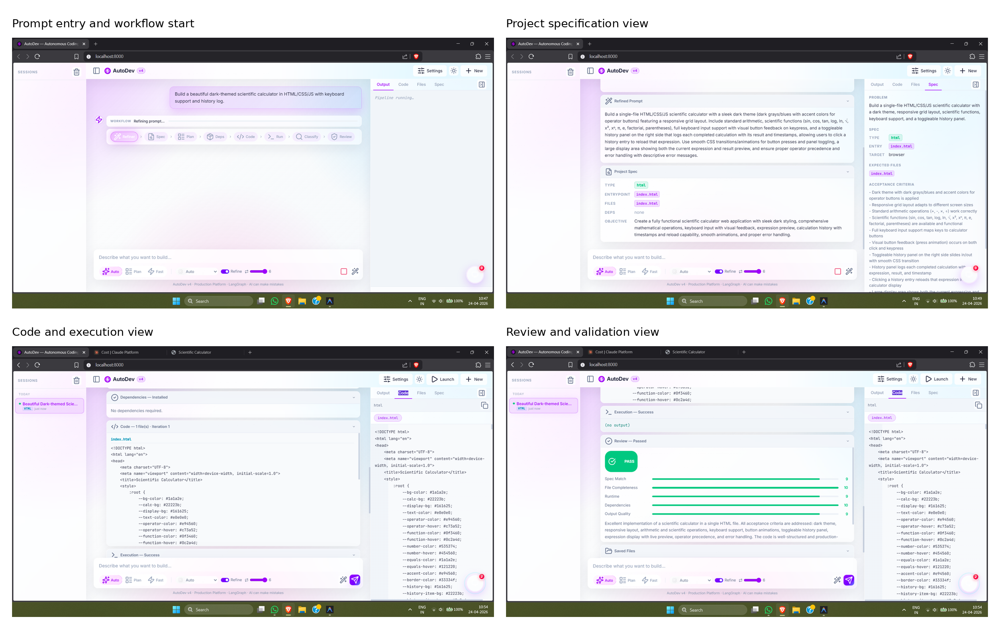

# Summary

AutoDev is a browser-based software system that turns a natural language request into a runnable project through a structured sequence of stages. A user describes what they want to build, and AutoDev refines the prompt, extracts a specification, prepares a plan, generates code, executes it, checks for errors, and revises the result when needed. The interface lets the user watch that process in real time, instead of treating code generation as a one-shot event.

The software is aimed at tasks where code must be produced, tested, and improved in sequence, such as small web applications, data processing scripts, networking exercises, and other software engineering experiments. Its main purpose is to reduce the amount of manual coordination normally required between planning, coding, execution, and debugging. The system therefore acts as an execution-aware development assistant rather than a simple text-to-code generator.

# Statement of need

Large language models can generate code quickly, but they often stop at the point where a human still needs to run, inspect, and repair the output. For longer tasks, that is not enough. The result may be syntactically plausible code that still fails at runtime, misses dependencies, or ignores earlier context. That gap is especially important in research and teaching settings, where users need a system that can expose the whole development process and preserve the state of a task across multiple steps.

AutoDev was built to address this need by organizing software generation as a multi-stage workflow with execution feedback and session continuity. It is intended for students, developers, and researchers who want to study or use workflow-based autonomous coding systems. The project also serves as a practical platform for experimenting with role separation, persistent memory, and iterative correction in software generation.

The paper does not claim that autonomous coding itself is new. Instead, the contribution is the integration of several established ideas into one environment: prompt refinement, planning, execution, review, and memory. This makes the system useful as both a development tool and a research artifact for studying how such pipelines behave in practice [@yao2022react; @madaan2023selfrefine; @shinn2023reflexion].

# State of the field

Related tools such as OpenHands and SWE-agent show that LLM-driven software systems can interact with codebases, execute commands, and work through software tasks in a more agent-like way than a plain chat interface [@wang2024openhands; @yang2024sweagent]. Other work, including Agentless, shows that simpler pipelines can sometimes outperform more elaborate agent stacks on specific debugging tasks [@xia2024agentless]. Research on planning-first and feedback-driven systems further shows that separating reasoning from execution can improve reliability, although at the cost of extra orchestration [@he2025planthenexecute; @lei2024planningdriven].

AutoDev is positioned in this landscape as a workflow integration effort. Its value is not a new foundation model or a new benchmark, but a complete, inspectable pipeline that combines browser interaction, backend orchestration, state persistence, retrieval support, and automatic correction in one system. Compared with direct code generation tools, it adds a visible execution loop. Compared with general autonomous coding systems, it emphasizes continuity across sessions and a clear handoff between prompt refinement, specification, planning, execution, and review.

The literature review also motivated an important design choice: the system should not rely on a single pass from prompt to code. Iterative refinement methods such as Self-Refine and Reflexion suggest that quality improves when the system can learn from its own earlier output [@madaan2023selfrefine; @shinn2023reflexion]. AutoDev applies that principle at the workflow level rather than only at the prompt level.

# Software design

AutoDev follows a layered client-server design. The frontend is a browser interface that accepts prompts, shows session history, and displays output panels. The backend is implemented with FastAPI and streams workflow events back to the interface. A LangGraph-based orchestration layer manages the task as a graph of stages, while the execution layer runs generated programs in a controlled subprocess so that output and errors can be captured safely. Persistent storage is used for files, sessions, and retrieval support.

{#fig-architecture}

This architecture was chosen to balance transparency and control. A single monolithic generator would be simpler, but it would hide the steps that matter most for debugging and research. A more fragmented multi-agent design would allow specialization, but it would also make state management and tracing harder. AutoDev therefore keeps the workflow modular, but not opaque. Each stage has a specific role, and the state passed between stages is explicit.

{#fig-sequence}

The main trade-off is that this design adds overhead. Planning, execution, validation, and possible repair take longer than a single generation pass. That cost is deliberate. In exchange, the system can check whether the produced code actually runs, classify failures, and attempt a corrective pass before returning the result. Session memory and retrieval augmented generation help the workflow reuse context across repeated attempts, which is useful when a task evolves over several runs.

{#fig-interface}

{#fig-workflow-ui}

Table 1 summarizes the main repository artifacts and what each one contributes to the submission.

| Artifact | What it shows | Why it matters |
| --- | --- | --- |
| `architecture.png` | layered browser, backend, workflow, and storage design | documents the system boundaries |
| `sequence.png` | prompt-to-review execution path | shows how the workflow progresses step by step |
| `interface-montage.png` | dashboard, code, output, and review views | demonstrates that the system is usable, not only conceptual |
| `workflow-ui-grid.png` | prompt entry, spec view, code view, and validation view | shows the staged UI that mirrors the workflow |
| repository code | FastAPI, LangGraph, sessions, and execution modules | provides the reproducible implementation |

# Research impact statement

AutoDev is released as a public software project with a documented workflow and example outputs [@autodev_repo]. The repository includes the code base, screenshots, workflow diagrams, and paper assets needed to rebuild the system and inspect how it behaves on real tasks. That makes the project useful to researchers studying autonomous coding, workflow orchestration, and execution-aware code generation.

The strongest near-term contribution is reproducibility rather than a single performance headline. The submission gives readers a working implementation, a visible workflow, and a set of interface and architecture artifacts that make the system easy to evaluate, extend, and compare with future autonomous coding tools. The project is therefore suitable as a research platform for method comparison, classroom demonstrations, and iterative experimentation.

The work also preserves a clear separation between the software itself and the manuscript claims. Instead of over-interpreting internal development figures, the paper focuses on the architecture, the workflow, and the research use case. That makes the submission more appropriate for JOSS, where the emphasis is on software quality, documentation, and reuse.

# AI usage disclosure

Generative AI was used in the software itself through external LLM providers for prompt refinement, planning, code generation, repair suggestions, and review. Generative AI was also used to assist in drafting this manuscript from the project report and screenshots. All claims, figures, and descriptions included here were checked against the source materials before finalizing the paper.

# Acknowledgements

The authors thank the Department of Computer Science and Engineering at Mahatma Gandhi Institute of Technology for infrastructure and supervision during the project. No external financial support was reported for this work.

# References
